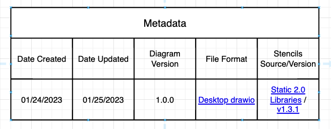
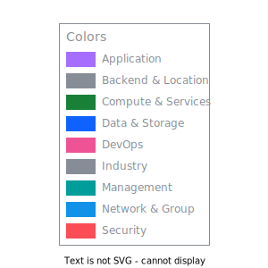

# IBM Cloud Stencils

Create IBM Cloud diagrams using Draw.io tool with IBM Cloud Architecture Stencils.  

[add here STOP GAP comment about availability in drawio]

If you are an IBM employee, go to the internal site here (link)

# Using IBM Cloud Stencils

## Overview

IBM stencils / shapes can be of any of the following formats
- Groups (previously referred to as boxes): they either represent a deployedOn relationship for locations (logical, virtual, physical) of platforms, infrastructure, network, etc, on which services and applications are deployed, or deployedTo relationships, in which one application, service or component is deployed on top of another. For example, a virtual server instance is `deployedOn` a zone and `deployedTo` a resource group.
- Nodes: which are meant to represent standalone components or devices.
- Actors: represent roles, functions or attributes played by human users, devices and other entities that interact with any of the above.

### Stencil Index/Inventory

Based on categories listed in the [overview section](#overview) section, several xml files are provided with groups of stencils, however, for convenience, an All-In-One xml (`ibm_all_in_one.xml`) file containing all shapes across categories is also provided and kept up to date under [drawio/stencils/2.0](/drawio/stencils/2.0).

[Click here to open](drawio/stencils/2.0/Index.tsv)

### Getting drawio desktop application

instructions/link to download desktop drawio 
https://github.com/jgraph/drawio-desktop/releases


### Getting stencil libraries compatible withdraw.io application

If you need to use shapes compatible/importable with/in desktop drawio application, a static version (same look and feel but no extended features of [build](#temporary--custom-build)) of the stencils has been made available under [drawio/stencils/2.0](/drawio/stencils/2.0) in this repository. To import the libraries follow the instructions in the [import guide](#importing-stencil-libraries-into-drawio) or watch the Draw.io Tool Video Tutorial in the [Tutorials section](#tutorials). Please keep in mind that when the libraries get updated (new, changed and deleted stencils) or new libraries get added/deleted, a [release](https://github.ibm.com/ibmcloud/ibm-cloud-stencils/releases) will be published in the repo.

[^1]: :information_source: **Important:** For diagrams to be hosted in governed content and/or public facing documents, repositories and sites, the [draw.io application](https://github.com/jgraph/drawio-desktop/releases) is the recommended approach.

### Examples

<details><summary>IBM Kubernetes Service in a Classic Single-Region Multi-Zone environment using v2.0 stencils and latest connector standards</summary>

  
</details>
<details><summary>IBM Red Hat OpenShift Service in a VPC Single-Region Multi-Zone environment using v2.0 stencils and latest connector standards</summary>

  
</details>
<details><summary>IBM Red Hat OpenShift Service in a Classic Single-Region Multi-Zone environment using v2.0 stencils and latest connector standards</summary>

  
</details>

### Templates

Find latest templates in [drawio/templates/v2.0](/drawio/templates/v2.0).
If using beta2 build (`vXXYY-ibm2beta2`), check out also the "IBM Starters" library to access common pre-built layouts that can be useful as starting points for diagrams.

## Importing Stencil Libraries into Draw.io [^3]

This section provides instructions on how to import stencils published in this repository (available in this path [drawio/stencils/](/drawio/stencils)) into draw.io desktop application.
Stencils/icons are added and grouped using libraries, the libraries can contain one or several stencils, these are saved and generated in XML format (.xml). To use these these custom libraries, they first must be imported in order to make them available in the draw.io utility. Remember that only desktop drawio application (as opposed to the [online counterpart](https://app.diagrams.net/))is authorized for IBM internal diagrams.

[^3]: :warning: Please note that an All-In-One (`ibm_all_in_one.xml`) file containing all stencils/shapes is now provided for v2.0 in this directory [drawio/stencils/2.0](/drawio/stencils/2.0).

### Import Guides

<details><summary>Import using Github Clone (Recommended)</summary>
<p>

### Prerequistes

- A [GitHub.ibm.com enterprise active account](https://github.ibm.com/).
- Git [CLI](https://gist.github.com/derhuerst/1b15ff4652a867391f03) or [GitHub Desktop](https://desktop.github.com/).
- An [SSH Key associated](https://docs.github.com/en/authentication/connecting-to-github-with-ssh/adding-a-new-ssh-key-to-your-github-account) to the github.com account if using CLI.
 
### Option 1 - GitHub Desktop Instructions

<details><summary>Click here to expand</summary>

- Sign into [github.ibm.com](https://github.ibm.com).
- In the main [page](https://github.ibm.com/ibmcloud/ibm-cloud-stencils), click the **Clone or download** button, select on **Open in Desktop**, wait for the prompt and select/confirm launching the link using GitHub Desktop application. Confirm directory where repository will be cloned:

  

  Click on **Clone** and wait for process to complete.

- Open the desktop [Draw.io application](https://github.com/jgraph/drawio-desktop/releases) in your computer or open [draw.io](https://www.draw.io/) in your browser.

- Select **Create New Diagram**, then click **Create**.

  <details><summary>If importing one library (.xml) at time</summary>
  <p>

  - Click on **File > Open Library**, browse your drawio folder in your cloned/local  directory and select the XML file, then click on **Open**. Repeat for every additional XML file you wish to import.

  - Confirm library or libraries are visible in the left panel:

    
  </details>
  <details><summary>If importing all libraries (.xmls) at the same time</summary>
  <p>

  - Go to `Extras`, then click `Configuration`
  - Hit `Preferences`
  - Edit the `customLibraries` block section to include the path to all the    XML files, see [default OS configurations](#default-configurations) below
  - click `Apply` and restart to refresh the changes.
  - Confirm library or libraries are visible in the left panel
     

  </details>

</details>


### Option 2 - GitHub CLI Instructions

<details><summary>Click here to expand</summary>

- Sign into [github.ibm.com](https://github.ibm.com).
- While in the main [page](https://github.ibm.com/ibmcloud/ibm-cloud-stencils), click the **Clone or download** button, select on **Use SSH** if not already selected (**Use HTTPS** will be displayed) and then copy the link using the copy symbol:

  

- CD to directory where you wish to clone this repository.

- Clone the repository using **git clone** syntax using the previously copied ssh link:

  ```
  $ git clone git@github.ibm.com:ibmcloud/ibm-cloud-stencils.git
  Cloning into 'ibm-cloud-stencils'...
  Enter passphrase for key '/Users/youruserid/.ssh/id_rsa': 
  ```
- Enter the passphrase of your SSH key.

- Confirm repository was successfully cloned, the CLI should display something like this:

  ```
  remote: Enumerating objects: 58893, done.
  remote: Total 58893 (delta 0), reused 0 (delta 0), pack-reused 58893
  Receiving objects: 100% (58893/58893), 185.09 MiB | 5.01 MiB/s, done.
  Resolving deltas: 100% (18944/18944), done.
  $ 
  ```
  <details><summary>If importing one library (.xml) at time</summary>
  <p>

  - Click on **File > Open Library**, browse your drawio folder in your cloned/local  directory and select the XML file, then click on **Open**. Repeat for every additional XML file you wish to import.

  - Confirm library or libraries are visible in the left panel:

    
  </details>
  <details><summary>If importing all libraries (.xmls) at the same time</summary>
  <p>

  - Go to `Extras`, then click `Configuration`
  - Hit `Preferences`
  - Edit the `customLibraries` block section to include the path to all the    XML files, see [default OS configurations](#default-configurations) below
  - click `Apply` and restart to refresh the changes.
  - Confirm library or libraries are visible in the left panel
     

</details>

#### Default configurations:
:exclamation: **Important**: stencils must be in reverse order in JSON to load in alphabetical order in drawio desktop.

- #### 1. Default drawio desktop preferences file for macOS:

    <details><summary>Click here to see code snippet</summary>
    
    ```json
    {
      "language": "",
      "configVersion": null,
      "customFonts": [],
      "libraries": "general;uml;er;bpmn;flowchart;basic;arrows2",
      "customLibraries": [
        "S/REPLACE_WITH_YOUR_PATH/ibm-cloud-stencils/drawio/stencils/2.0/ibm_uml_relationships.xml",
        "S/REPLACE_WITH_YOUR_PATH/ibm-cloud-stencils/drawio/stencils/2.0/ibm_sequence_numbers.xml",
        "S/REPLACE_WITH_YOUR_PATH/ibm-cloud-stencils/drawio/stencils/2.0/ibm_core_storage.xml",
        "S/REPLACE_WITH_YOUR_PATH/ibm-cloud-stencils/drawio/stencils/2.0/ibm_core_security_devices.xml",
        "S/REPLACE_WITH_YOUR_PATH/ibm-cloud-stencils/drawio/stencils/2.0/ibm_core_security.xml",
        "S/REPLACE_WITH_YOUR_PATH/ibm-cloud-stencils/drawio/stencils/2.0/ibm_core_network_devices.xml",
        "S/REPLACE_WITH_YOUR_PATH/ibm-cloud-stencils/drawio/stencils/2.0/ibm_core_network.xml",
        "S/REPLACE_WITH_YOUR_PATH/ibm-cloud-stencils/drawio/stencils/2.0/ibm_core_management.xml",
        "S/REPLACE_WITH_YOUR_PATH/ibm-cloud-stencils/drawio/stencils/2.0/ibm_core_groups_security.xml",
        "S/REPLACE_WITH_YOUR_PATH/ibm-cloud-stencils/drawio/stencils/2.0/ibm_core_groups_network.xml",
        "S/REPLACE_WITH_YOUR_PATH/ibm-cloud-stencils/drawio/stencils/2.0/ibm_core_groups_locations.xml",
        "S/REPLACE_WITH_YOUR_PATH/ibm-cloud-stencils/drawio/stencils/2.0/ibm_core_groups_containers.xml",
        "S/REPLACE_WITH_YOUR_PATH/ibm-cloud-stencils/drawio/stencils/2.0/ibm_core_groups_compute.xml",
        "S/REPLACE_WITH_YOUR_PATH/ibm-cloud-stencils/drawio/stencils/2.0/ibm_core_groups_actors.xml",
        "S/REPLACE_WITH_YOUR_PATH/ibm-cloud-stencils/drawio/stencils/2.0/ibm_core_groups.xml",
        "S/REPLACE_WITH_YOUR_PATH/ibm-cloud-stencils/drawio/stencils/2.0/ibm_core_devops.xml",
        "S/REPLACE_WITH_YOUR_PATH/ibm-cloud-stencils/drawio/stencils/2.0/ibm_core_data.xml",
        "S/REPLACE_WITH_YOUR_PATH/ibm-cloud-stencils/drawio/stencils/2.0/ibm_core_compute_devices.xml",
        "S/REPLACE_WITH_YOUR_PATH/ibm-cloud-stencils/drawio/stencils/2.0/ibm_core_compute_containers.xml",
        "S/REPLACE_WITH_YOUR_PATH/ibm-cloud-stencils/drawio/stencils/2.0/ibm_core_compute.xml",
        "S/REPLACE_WITH_YOUR_PATH/ibm-cloud-stencils/drawio/stencils/2.0/ibm_core_applications.xml",
        "S/REPLACE_WITH_YOUR_PATH/ibm-cloud-stencils/drawio/stencils/2.0/ibm_core_actors_users.xml",
        "S/REPLACE_WITH_YOUR_PATH/ibm-cloud-stencils/drawio/stencils/2.0/ibm_core_actors_locations.xml",
        "S/REPLACE_WITH_YOUR_PATH/ibm-cloud-stencils/drawio/stencils/2.0/ibm_core_actors_devices.xml",
        "S/REPLACE_WITH_YOUR_PATH/ibm-cloud-stencils/drawio/stencils/2.0/ibm_cloud_storage_devices.xml",
        "S/REPLACE_WITH_YOUR_PATH/ibm-cloud-stencils/drawio/stencils/2.0/ibm_cloud_storage.xml",
        "S/REPLACE_WITH_YOUR_PATH/ibm-cloud-stencils/drawio/stencils/2.0/ibm_cloud_security.xml",
        "S/REPLACE_WITH_YOUR_PATH/ibm-cloud-stencils/drawio/stencils/2.0/ibm_cloud_paks.xml",
        "S/REPLACE_WITH_YOUR_PATH/ibm-cloud-stencils/drawio/stencils/2.0/ibm_cloud_network_devices.xml",
        "S/REPLACE_WITH_YOUR_PATH/ibm-cloud-stencils/drawio/stencils/2.0/ibm_cloud_network.xml",
        "S/REPLACE_WITH_YOUR_PATH/ibm-cloud-stencils/drawio/stencils/2.0/ibm_cloud_management.xml",
        "S/REPLACE_WITH_YOUR_PATH/ibm-cloud-stencils/drawio/stencils/2.0/ibm_cloud_groups_security.xml",
        "S/REPLACE_WITH_YOUR_PATH/ibm-cloud-stencils/drawio/stencils/2.0/ibm_cloud_groups_network.xml",
        "S/REPLACE_WITH_YOUR_PATH/ibm-cloud-stencils/drawio/stencils/2.0/ibm_cloud_groups_locations.xml",
        "S/REPLACE_WITH_YOUR_PATH/ibm-cloud-stencils/drawio/stencils/2.0/ibm_cloud_groups.xml",
        "S/REPLACE_WITH_YOUR_PATH/ibm-cloud-stencils/drawio/stencils/2.0/ibm_cloud_data_databases.xml",
        "S/REPLACE_WITH_YOUR_PATH/ibm-cloud-stencils/drawio/stencils/2.0/ibm_cloud_compute_devices.xml",
        "S/REPLACE_WITH_YOUR_PATH/ibm-cloud-stencils/drawio/stencils/2.0/ibm_cloud_compute.xml",
        "S/REPLACE_WITH_YOUR_PATH/ibm-cloud-stencils/drawio/stencils/2.0/ibm_cloud_applications.xml",
        "S/REPLACE_WITH_YOUR_PATH/ibm-cloud-stencils/drawio/stencils/2.0/ibm_all_in_one.xml",
        "S/REPLACE_WITH_YOUR_PATH/ibm-cloud-stencils/drawio/stencils/2.0/3rd Party Products.xml"
      ],
      "plugins": [],
      "recentColors": [],
      "formatWidth": "240",
      "createTarget": false,
      "pageFormat": {
        "x": 0,
        "y": 0,
        "width": 827,
        "height": 1169
      },
      "search": true,
      "showStartScreen": true,
      "gridColor": "#d0d0d0",
      "darkGridColor": "#424242",
      "autosave": false,
      "resizeImages": null,
      "openCounter": 1,
      "version": 18,
      "unit": 1,
      "isRulerOn": false,
      "ui": ""
    }
    ```   
    
   
    
    
    </details>


</p>
</details>
<details><summary>Import using Download Zip</summary>
<p>

- To download all contents of the repository, navigate to the main [page](README.md), click the **Clone or download** button and then select **Download ZIP**.

- Go to your downloads directory and extract the ZIP file contents and access the folder called **drawio**, it should be located in the following path:

  `YourDownloadsDirectory/ibm-cloud-stencils-master/drawio`

- Confirm XML file(s) you wish to import are visible inside the the drawio folder in your downloads directory:


- Open the desktop [Draw.io application](https://github.com/jgraph/drawio-desktop/releases) in your computer or open [draw.io](https://www.draw.io/) in your browser.

- Select **Create New Diagram**, then click **Create**.

- Click on **File > Open Library**, browse your drawio folder in your downloads directory and select the XML file, then click on **Open**. Repeat for every additional XML file you wish to import.

- Confirm library or libraries are visible in the left panel:

  

  If you run into issues, please use Github Clone approach (below)
</p>
</details>

## Tutorials

<details><summary>Draw.io Official Desktop Tool Video Tutorial</summary>
<p>


https://media.github.ibm.com/user/94907/files/154fd6d3-573a-4c14-a7ba-25ff57c3c821


 
</p>
</details>


## Tools & Conventions


<details><summary>Metadata header</summary>
<p>

As outlined in [section](#v20), diagrams in 2.0 version are created in the official/native desktop drawio application. To help users and teams consuming diagrams, it is highly recommended to include the metadata header/page to indicate the version/release of stencils used and ensure proper software/tooling is selected/downloaded when further editing is needed. The header will also help keep track of updates in the diagram.

Below you will find an example when using static:



The recommended options/combinations for the interesting fields are:

### If using [desktop drawio](#compatible-with-official-drawio-application-1)
| File Format | Stencils Source/Version|
|-|-|
| `Desktop drawio` | `Static 2.0 Libraries / vXY` |


### If using [custom build](#temporary--custom-build-2)

| File Format | Stencils Source/Version|
|-|-|
| `Build` | `vXY` |


When using build, `vXY` ideally would indicate pre-release version that used. For example [v30.2.56](https://github.ibm.com/ibmcloud/ibm-cloud-stencils/releases/tag/v30.2.56-ibm2beta2), if using desktop drawio, vXY would indicate [release/tag number](https://github.ibm.com/ibmcloud/ibm-cloud-stencils/releases), for example [v1.5.0](https://github.ibm.com/ibmcloud/ibm-cloud-stencils/releases/tag/v1.5.0).

Templates with the above metadata table are available as follows:
- `Metadata.xml`: for using in new/existing diagrams created in both desktop drawio and build. Available in [drawio/templates/v2.0](/drawio/templates/v2.0)
- `Metadata build template.drawio`: for using in new diagrams created in build. Available under [drawio/templates/v2.0/Using Build](/drawio/templates/v2.0/Using%20Build)
- `Metadata static template.drawio`: for using in new diagrams created in desktop drawio. Available under [drawio/templates/v2.0/Using Static - compatible with drawio tool](/drawio/templates/v2.0/Using%20Static%20-%20compatible%20with%20drawio%20tool)
 
</p>
</details>


<details><summary>Colors</summary>
<p>



</p>
</details>

<details><summary>Connectors</summary>
<p>

  
  
Please see the [Connectors file](/drawio/Connectors.drawio) with draw.io format version of the picture above or import the [IBM Connectors xml library](/drawio/stencils/ibm_connectors.xml).

</p>
</details>

## Help & Support

For additional help and support on how to use stencils and drawio, start a thread in the [#ibm-cloud-stencils](https://ibm-cloudplatform.slack.com/archives/C010ARBDZ9R) slack channel and if necessary open an [issue](https://github.ibm.com/ibmcloud/ibm-cloud-stencils/issues).

