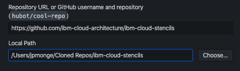
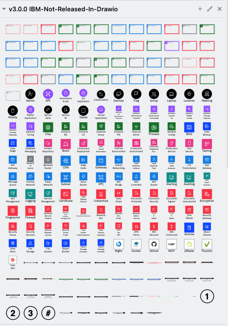
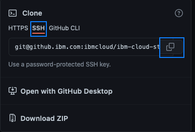
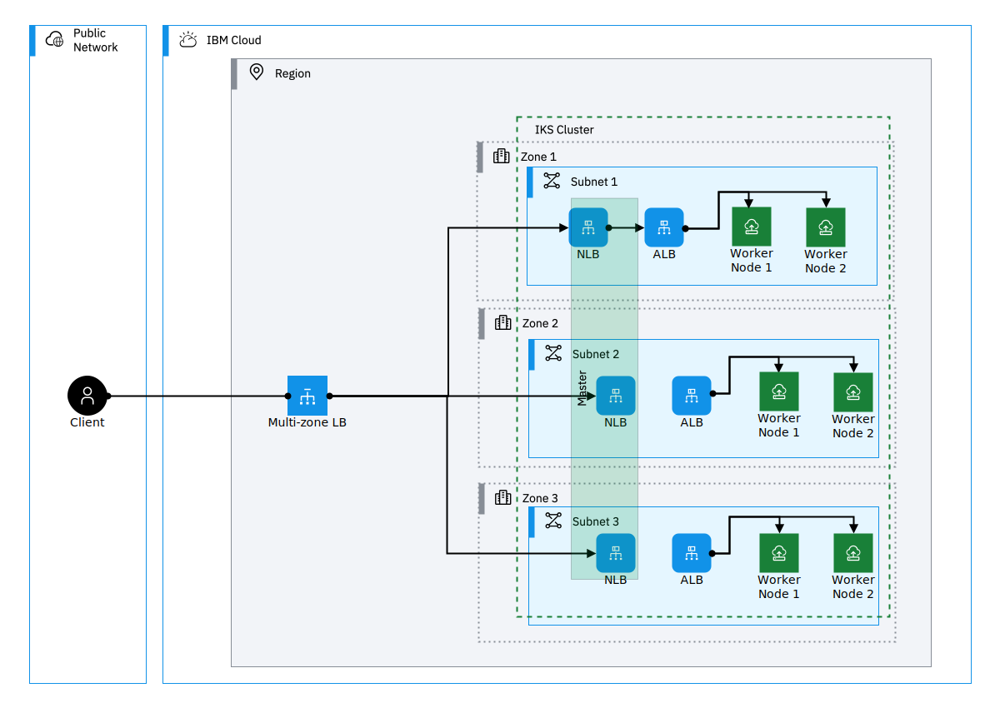
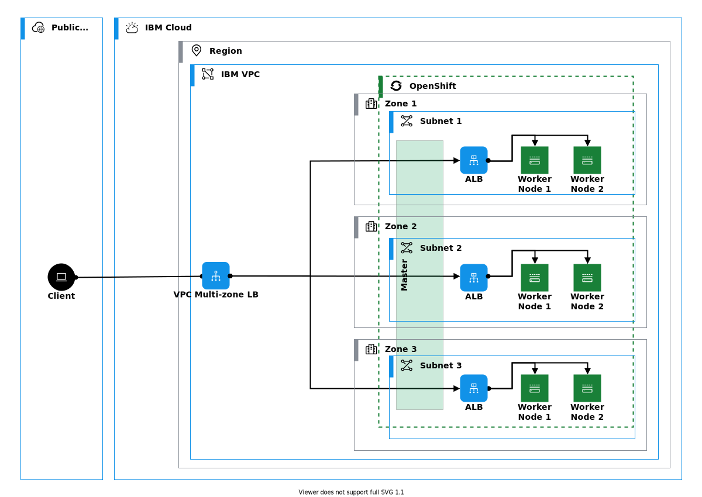
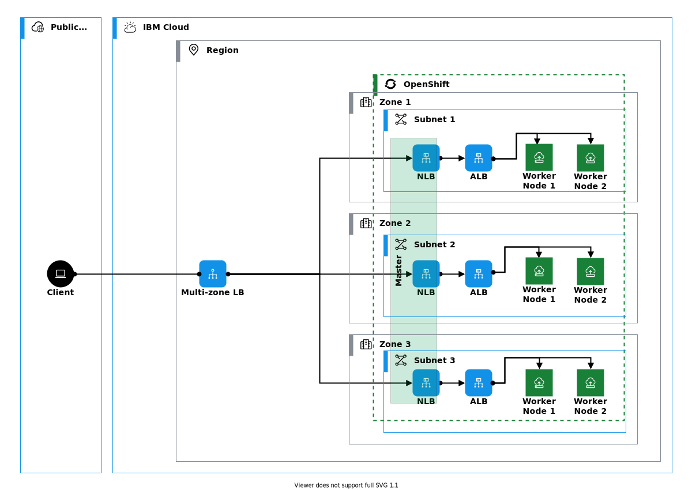
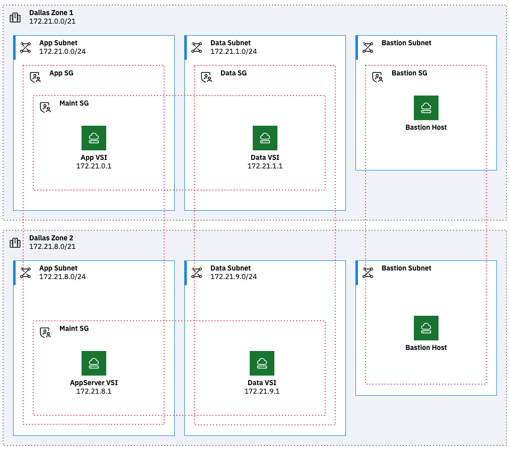
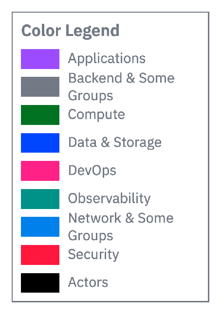
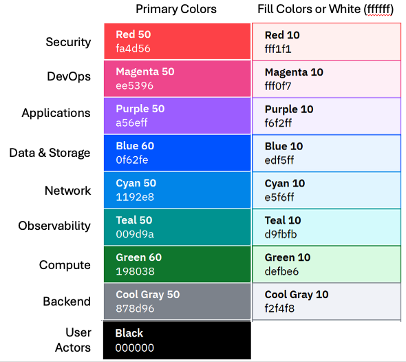
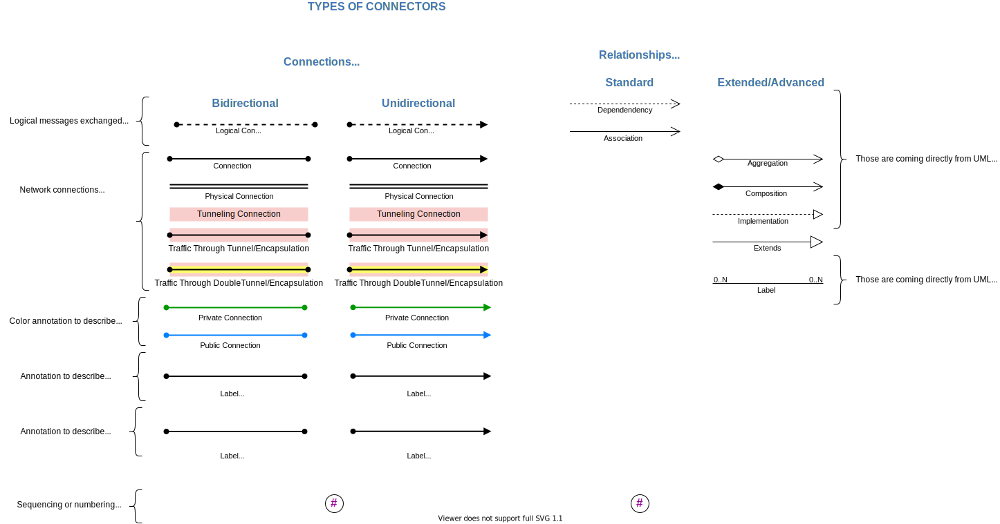

# IBM Cloud Stencils

NOTE: If you are an IBM employee, please go to the [internal repo](https://github.ibm.com/ibmcloud/ibm-cloud-stencils)

Create IBM Cloud diagrams using Draw.io tool with IBM Cloud Architecture Stencils.  

This repo is intended to provide IBM Cloud Architecture icons for external customers and business partners.  IBM Cloud's approved design tool is Draw.io, however we have also provided Powerpoint (.ppt) and SVG (.svg) files for your convenience.

This repository is an interim source to obtain the icons.

## Drawio (xml & drawio)

<details><summary>click here to expand</summary>

### Getting drawio desktop application


Go to the [jgraph drawio repo site](https://github.com/jgraph/drawio-desktop/releases) to download the latest desktop draw.io application.


#### Stencil Index/Inventory

Based on categories listed in the [overview section](#overview) section, several xml files are provided with groups of stencils, however, for convenience, an All-In-One xml (`ibm_all_in_one.xml`) file containing all shapes across categories is also provided and kept up to date under [drawio/stencils/2.0](/drawio/stencils/2.0).

[Click here to open](drawio/stencils/2.0/Index.tsv)


### Getting stencil libraries compatible with draw.io application

If you need to use 2.0 shapes compatible/importable with/in desktop drawio application, a static version of the stencils has been made available under [drawio/stencils/2.0](/drawio/stencils/2.0) in this repository. To import the libraries (.xmls), follow the instructions in the [import guide below](#import-guide). Please keep in mind that when the libraries get updated (new, changed and deleted stencils) or new libraries get added/deleted, a [release](https://github.com/IBM-Cloud/architecture-icons/releases) will be published in the repo.


#### Import Guide

<details><summary> Importing Stencil Libraries into Draw.io desktop tool</summary>
<p>

This section provides instructions on how to import stencils published in this repository (available in this path [drawio/stencils/2.0](/drawio/stencils/2.0)) into draw.io desktop application.
Stencils/icons are added and grouped using libraries, the libraries can contain one or several stencils, these are saved and generated in XML format (.xml). To use these these custom libraries, they first must be imported in order to make them available in the draw.io utility/tool.

[^3]: :warning: Please note that the following All-in-one options have been made available:

- All-in-one (`ibm_all_in_one.xml`) importable file containing all stencils/shapes is now provided for v2.0 in this directory [drawio/stencils/2.0/ibm_all_in_one.xml](/drawio/stencils/2.0/ibm_all_in_one.xml).

- If getting started with draw.io, All-in-one (`v2.0.0-all-in-one-stencils.drawio`) double-clickable file containing all stencils/shapes is now provided for v2.0 in this directory [drawio/stencils/2.0/v2.0.0-all-in-one-stencils.drawio](/drawio/stencils/2.0/v2.0.0-all-in-one-stencils.drawio)

### Import Guides

<details><summary>Import using Github Clone (Recommended)</summary>
<p>

### Prerequistes

- A [GitHub.com active account](https://github.com/).
- Git [CLI](https://gist.github.com/derhuerst/1b15ff4652a867391f03) or [GitHub Desktop](https://desktop.github.com/).
- An [SSH Key associated](https://docs.github.com/en/authentication/connecting-to-github-with-ssh/adding-a-new-ssh-key-to-your-github-account) to the github.com account if using CLI.
 
### Option 1 - GitHub Desktop Instructions

<details><summary>Click here to expand</summary>

- Sign into [github.ibm.com](https://github.ibm.com).
- In the main [page](https://github.com/IBM-Cloud/architecture-icons), click the **Clone or download** button, select on **Open in Desktop**, wait for the prompt and select/confirm launching the link using GitHub Desktop application. Confirm directory where repository will be cloned:

  

  Click on **Clone** and wait for process to complete.

- Open the desktop [Draw.io application](https://github.com/jgraph/drawio-desktop/releases) in your computer or open [draw.io](https://www.draw.io/) in your browser.

- Select **Create New Diagram**, then click **Create**.

  <details><summary>If importing one library (.xml) at time</summary>
  <p>

  - Click on **File > Open Library**, browse your drawio folder in your cloned/local  directory and select the XML file, then click on **Open**. Repeat for every additional XML file you wish to import.

  - Confirm library or libraries are visible in the left panel:

    
  </details>
  <details><summary>If importing all libraries (.xmls) at the same time</summary>
  <p>

  - Go to `Extras`, then click `Configuration`
  - Hit `Preferences`
  - Edit the `customLibraries` block section to include the path to all the    XML files, see [default OS configurations](#default-configurations) below
  - click `Apply` and restart to refresh the changes.
  - Confirm library or libraries are visible in the left panel
     

  </details>

</details>


### Option 2 - GitHub CLI Instructions

<details><summary>Click here to expand</summary>

- Sign into [github.com](https://github.com).
- While in the main [page](https://github.com/IBM-Cloud/architecture-icons), click the **Clone or download** button, select on **Use SSH** if not already selected (**Use HTTPS** will be displayed) and then copy the link using the copy symbol:

  

- CD to directory where you wish to clone this repository.

- Clone the repository using **git clone** syntax using the previously copied ssh link:

  ```
  $ git clone git@github.ibm.com:ibmcloud/ibm-cloud-stencils.git
  Cloning into 'ibm-cloud-stencils'...
  Enter passphrase for key '/Users/youruserid/.ssh/id_rsa': 
  ```
- Enter the passphrase of your SSH key.

- Confirm repository was successfully cloned, the CLI should display something like this:

  ```
  remote: Enumerating objects: 58893, done.
  remote: Total 58893 (delta 0), reused 0 (delta 0), pack-reused 58893
  Receiving objects: 100% (58893/58893), 185.09 MiB | 5.01 MiB/s, done.
  Resolving deltas: 100% (18944/18944), done.
  $ 
  ```
  <details><summary>If importing one library (.xml) at time</summary>
  <p>

  - Click on **File > Open Library**, browse your drawio folder in your cloned/local  directory and select the XML file, then click on **Open**. Repeat for every additional XML file you wish to import.

  - Confirm library or libraries are visible in the left panel:

    
  </details>
  <details><summary>If importing all libraries (.xmls) at the same time</summary>
  <p>

  - Go to `Extras`, then click `Configuration`
  - Hit `Preferences`
  - Edit the `customLibraries` block section to include the path to all the    XML files, see default OS configurations below
  - click `Apply` and restart to refresh the changes.
  - Confirm library or libraries are visible in the left panel
     

</details>

#### Default configurations:
:exclamation: **Important**: stencils must be in reverse order in JSON to load in alphabetical order in drawio desktop.

- #### 1. Default drawio desktop preferences file for macOS:

    <details><summary>Click here to see code snippet</summary>
    
    ```json
    {
      "language": "",
      "configVersion": null,
      "customFonts": [],
      "libraries": "general;uml;er;bpmn;flowchart;basic;arrows2",
      "customLibraries": [
        "S/REPLACE_WITH_YOUR_PATH/ibm-cloud-stencils/drawio/stencils/2.0/ibm_uml_relationships.xml",
        "S/REPLACE_WITH_YOUR_PATH/ibm-cloud-stencils/drawio/stencils/2.0/ibm_sequence_numbers.xml",
        "S/REPLACE_WITH_YOUR_PATH/ibm-cloud-stencils/drawio/stencils/2.0/ibm_core_storage.xml",
        "S/REPLACE_WITH_YOUR_PATH/ibm-cloud-stencils/drawio/stencils/2.0/ibm_core_security_devices.xml",
        "S/REPLACE_WITH_YOUR_PATH/ibm-cloud-stencils/drawio/stencils/2.0/ibm_core_security.xml",
        "S/REPLACE_WITH_YOUR_PATH/ibm-cloud-stencils/drawio/stencils/2.0/ibm_core_network_devices.xml",
        "S/REPLACE_WITH_YOUR_PATH/ibm-cloud-stencils/drawio/stencils/2.0/ibm_core_network.xml",
        "S/REPLACE_WITH_YOUR_PATH/ibm-cloud-stencils/drawio/stencils/2.0/ibm_core_management.xml",
        "S/REPLACE_WITH_YOUR_PATH/ibm-cloud-stencils/drawio/stencils/2.0/ibm_core_groups_security.xml",
        "S/REPLACE_WITH_YOUR_PATH/ibm-cloud-stencils/drawio/stencils/2.0/ibm_core_groups_network.xml",
        "S/REPLACE_WITH_YOUR_PATH/ibm-cloud-stencils/drawio/stencils/2.0/ibm_core_groups_locations.xml",
        "S/REPLACE_WITH_YOUR_PATH/ibm-cloud-stencils/drawio/stencils/2.0/ibm_core_groups_containers.xml",
        "S/REPLACE_WITH_YOUR_PATH/ibm-cloud-stencils/drawio/stencils/2.0/ibm_core_groups_compute.xml",
        "S/REPLACE_WITH_YOUR_PATH/ibm-cloud-stencils/drawio/stencils/2.0/ibm_core_groups_actors.xml",
        "S/REPLACE_WITH_YOUR_PATH/ibm-cloud-stencils/drawio/stencils/2.0/ibm_core_groups.xml",
        "S/REPLACE_WITH_YOUR_PATH/ibm-cloud-stencils/drawio/stencils/2.0/ibm_core_devops.xml",
        "S/REPLACE_WITH_YOUR_PATH/ibm-cloud-stencils/drawio/stencils/2.0/ibm_core_data.xml",
        "S/REPLACE_WITH_YOUR_PATH/ibm-cloud-stencils/drawio/stencils/2.0/ibm_core_compute_devices.xml",
        "S/REPLACE_WITH_YOUR_PATH/ibm-cloud-stencils/drawio/stencils/2.0/ibm_core_compute_containers.xml",
        "S/REPLACE_WITH_YOUR_PATH/ibm-cloud-stencils/drawio/stencils/2.0/ibm_core_compute.xml",
        "S/REPLACE_WITH_YOUR_PATH/ibm-cloud-stencils/drawio/stencils/2.0/ibm_core_applications.xml",
        "S/REPLACE_WITH_YOUR_PATH/ibm-cloud-stencils/drawio/stencils/2.0/ibm_core_actors_users.xml",
        "S/REPLACE_WITH_YOUR_PATH/ibm-cloud-stencils/drawio/stencils/2.0/ibm_core_actors_locations.xml",
        "S/REPLACE_WITH_YOUR_PATH/ibm-cloud-stencils/drawio/stencils/2.0/ibm_core_actors_devices.xml",
        "S/REPLACE_WITH_YOUR_PATH/ibm-cloud-stencils/drawio/stencils/2.0/ibm_cloud_storage_devices.xml",
        "S/REPLACE_WITH_YOUR_PATH/ibm-cloud-stencils/drawio/stencils/2.0/ibm_cloud_storage.xml",
        "S/REPLACE_WITH_YOUR_PATH/ibm-cloud-stencils/drawio/stencils/2.0/ibm_cloud_security.xml",
        "S/REPLACE_WITH_YOUR_PATH/ibm-cloud-stencils/drawio/stencils/2.0/ibm_cloud_paks.xml",
        "S/REPLACE_WITH_YOUR_PATH/ibm-cloud-stencils/drawio/stencils/2.0/ibm_cloud_network_devices.xml",
        "S/REPLACE_WITH_YOUR_PATH/ibm-cloud-stencils/drawio/stencils/2.0/ibm_cloud_network.xml",
        "S/REPLACE_WITH_YOUR_PATH/ibm-cloud-stencils/drawio/stencils/2.0/ibm_cloud_management.xml",
        "S/REPLACE_WITH_YOUR_PATH/ibm-cloud-stencils/drawio/stencils/2.0/ibm_cloud_groups_security.xml",
        "S/REPLACE_WITH_YOUR_PATH/ibm-cloud-stencils/drawio/stencils/2.0/ibm_cloud_groups_network.xml",
        "S/REPLACE_WITH_YOUR_PATH/ibm-cloud-stencils/drawio/stencils/2.0/ibm_cloud_groups_locations.xml",
        "S/REPLACE_WITH_YOUR_PATH/ibm-cloud-stencils/drawio/stencils/2.0/ibm_cloud_groups.xml",
        "S/REPLACE_WITH_YOUR_PATH/ibm-cloud-stencils/drawio/stencils/2.0/ibm_cloud_data_databases.xml",
        "S/REPLACE_WITH_YOUR_PATH/ibm-cloud-stencils/drawio/stencils/2.0/ibm_cloud_compute_devices.xml",
        "S/REPLACE_WITH_YOUR_PATH/ibm-cloud-stencils/drawio/stencils/2.0/ibm_cloud_compute.xml",
        "S/REPLACE_WITH_YOUR_PATH/ibm-cloud-stencils/drawio/stencils/2.0/ibm_cloud_applications.xml",
        "S/REPLACE_WITH_YOUR_PATH/ibm-cloud-stencils/drawio/stencils/2.0/ibm_all_in_one.xml",
        "S/REPLACE_WITH_YOUR_PATH/ibm-cloud-stencils/drawio/stencils/2.0/3rd Party Products.xml"
      ],
      "plugins": [],
      "recentColors": [],
      "formatWidth": "240",
      "createTarget": false,
      "pageFormat": {
        "x": 0,
        "y": 0,
        "width": 827,
        "height": 1169
      },
      "search": true,
      "showStartScreen": true,
      "gridColor": "#d0d0d0",
      "darkGridColor": "#424242",
      "autosave": false,
      "resizeImages": null,
      "openCounter": 1,
      "version": 18,
      "unit": 1,
      "isRulerOn": false,
      "ui": ""
    }
    ```   
    
   
    
    
    </details>


</p>
</details>

<details><summary>Import using Download Zip</summary>
<p>

- To download all contents of the repository, navigate to the main [page](README.md), click the **Clone or download** button and then select **Download ZIP**. Alternatively, if downloading a specific version/release, go the [releases page](https://github.ibm.com/ibmcloud/ibm-cloud-stencils/releases), select the one needed and hit the `source code (zip)` button.

- Go to your downloads directory and extract the ZIP file contents and access the folder called **drawio**, it should be located in the following path:

  `YourDownloadsDirectory/ibm-cloud-stencils-master/drawio`

- Confirm XML file(s) you wish to import are visible inside the the drawio folder in your downloads directory:


- Open the desktop [Draw.io application](https://github.com/jgraph/drawio-desktop/releases) in your computer or open [draw.io](https://www.draw.io/) in your browser.

- Select **Create New Diagram**, then click **Create**.

- Click on **File > Open Library**, browse your drawio folder in your downloads directory and select the XML file, then click on **Open**. Repeat for every additional XML file you wish to import.

- Confirm library or libraries are visible in the left panel:

  

  If you run into issues, please use Github Clone approach (below)
</p>
</details>
 
</p>
</details>


### v2.0 Examples

> **Important**
To be updated to 24pt size

<details><summary>IBM Kubernetes Service in a Classic Single-Region Multi-Zone environment using v2.0 stencils and latest connector standards</summary>

  
</details>
<details><summary>IBM Red Hat OpenShift Service in a VPC Single-Region Multi-Zone environment using v2.0 stencils and latest connector standards</summary>

  
</details>
<details><summary>IBM Red Hat OpenShift Service in a Classic Single-Region Multi-Zone environment using v2.0 stencils and latest connector standards</summary>

  
</details>

### v2.0 Templates

> **Important**
To be updated to 24pt size

Find latest templates in [drawio/templates/v2.0](/drawio/templates/v2.0).

</details>

## PowerPoint (ppt)

<details><summary>click here to expand</summary>

> **Important**
To be updated soon

Link to [folder](/ppt) 

</details>

### Scalable Vector Graphics (svg)

<details><summary>click here to expand</summary>

> **Important**
To be updated soon

Link to [folder](/svg) 

</details>

## Tools & Conventions


<details><summary>Format & Layout</summary>
<p>

IBM stencils / shapes can be of any of the following formats
- Groups (container groups with solid border): represent a deployedOn relationship for locations (logical, virtual, physical) of platforms, infrastructure, network, etc, on which services and applications are deployed.  For example, a virtual server instance is `deployedOn` a subnet (refer to example below).
- Zones (non-container groups with dashed border): represent a deployedTo relationship in which one application, service or component is deployed on top of another. For example, a virtual server instance is `deployedTo` a security group (refer to example below).
- Nodes (square shapes): are meant to represent standalone components or devices.
- Actors (round shapes): represent roles, functions or attributes played by human users, devices and other entities that interact with any of the above.

This example shows the App VSI deployedTo App Subnet and App VSI deployedOn both the Maint SG and App SG. 


Note that using a non-container group for security group prevents ambiguities as to whether the App VSI is physically in the subnet or a security group if the security group were a container group, however since the security group is a non-container group the App VSI only physically in the subnet on the diagram.  Instead of a mouse click to get inside of a non-container group the alt-click (option-click on Mac) is used.

</p>
</details>


<details><summary>Colors</summary>
<p>



Codes for the above colors correspond to the following primary color codes.  Fill colors are either white or the light color from the same color family as the corresponding primary color.  For example, Cyan 50 is the primary color for Network and the corresponding fill color for a network group is either white or Cyan 10 for accessibility. 



</p>
</details>

<details><summary>Connectors</summary>
<p>

  
  
Please see the [Connectors file](/drawio/stencils/Connectors.drawio) with draw.io format version of the picture above or import the [IBM Connectors xml library](/drawio/stencils/ibm_connectors.xml).

</p>
</details>

## Help & Support

For additional help and support on how to use stencils and drawio, please open an [issue](https://github.com/IBM-Cloud/architecture-icons/issues).
