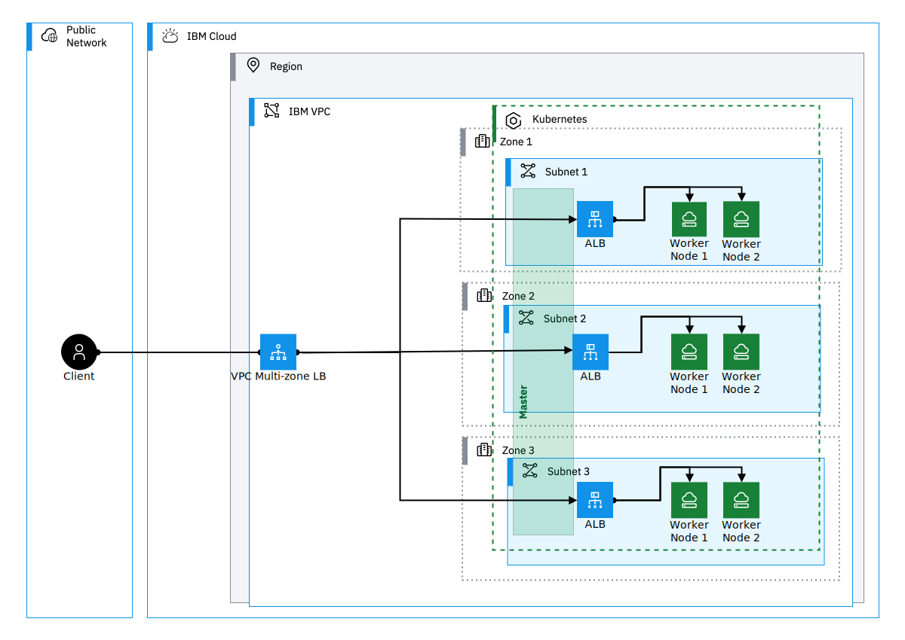

[](https://github.com/IBM-Cloud/architecture-icons/releases/latest)

# IBM Cloud Stencils

NOTE: If you are an IBM employee, please go to the [internal repo](https://github.ibm.com/ibmcloud/ibm-cloud-stencils)

Create IBM Cloud diagrams using Draw.io tool with IBM Cloud Architecture Stencils.  

This repo is intended to provide IBM Cloud Architecture icons for external customers and business partners.  IBM Cloud's approved design tool is Draw.io, however we have also provided Powerpoint (.ppt) and SVG (.svg) files for your convenience.

This repository is an interim source to obtain the icons.

## Quick Start

To get IBM Cloud architecture stencils and start sketching diagrams with draw.io tool, follow the steps in this section:

#### 1. Download desktop draw.io application in the [jgraph drawio official repo](https://github.com/jgraph/drawio-desktop/releases).

#### 2. Select one of the following to get stencils:

  <details><summary>Saving All-in-one in computer - Github not required</summary>
   
  1. Go to the all-in-one online file by clicking [here](https://github.com/IBM-Cloud/architecture-icons/blob/main/drawio/stencils/2.0/ibm_all_in_one.xml)
  
  2. Hit the `Raw` button
  
  1. Save file by right-clicking and selecting `Save Page As`
  2. Select a directory to save file.
  3. Open draw.io desktop application.
  4. In the upper left-hand menu, go to `File > Open Library`   and navigate to the folder where you previously saved the All-in-one xml file in your computer, hit `Open`.
  5. Go to [Step 3](#3-sketch-diagram-using-the-imported-stencil-libraries-in-the-left-hand-size-of-the-drawio-desktop-app-ui-all-in-one-and-standalone-xmls-include)
  
  </details>

  <details><summary>Using Github Repo Clone</summary>

  [Clone](#drawio---importing-stencil-libraries-into-drawio-desktop-tool-step-by-step) this [repo](https://github.com/IBM-Cloud/architecture-icons) and use one of the following options:

   - ##### a. If starting a diagram from scratch:
  
     <details><summary>Click here</summary>

       1. Open draw.io desktop application.
       2. In the upper left-hand menu, go to `File > Open Library`   and navigate to the [drawio/stencils/2.0 folder](/drawio/stencils/2.0) in your clone. 
       3. Select either the All-in-one library ([`ibm_all_in_one.xml`](/drawio/stencils/2.0/ibm_all_in_one.xml)) or any of the xml library(ies) of your choice (compute, data, network, etc.).
       4. Go to [Step 3](#3-sketch-diagram-using-the-imported-stencil-libraries-in-the-left-hand-size-of-the-drawio-desktop-app-ui-all-in-one-and-standalone-xmls-include)
   
        For detailed import instructions watch this video [tutorial](https://cloud.ibm.com/docs/architecture-framework?topic=architecture-framework-architecture-diagram) or follow the [step-by-step tutorial/guide](#drawio---importing-stencil-libraries-into-drawio-desktop-tool-step-by-step).

       

     </details>

   - ##### b. If already have stencils and starting from an existing diagram template:
  
     <details><summary>Click here</summary>

       1. Open the stencils repo clone folder.
       2. Go to [drawio/templates/2.0](/drawio/templates/2.0) folder and open/double-click any of the template files.

     </details>

  </details>

#### 3. Sketch diagram using the imported stencil libraries in the left-hand size of the drawio desktop app UI. All-in-one and standalone xmls include:
   - Stencils (actors, nodes, groups/boxes)
   - Connectors
   - UML
   - Legends
   - Sequence numbers

<details><summary>Click to see see library breakdown</summary>

|          **Library Type**          |                                                         All-in-one                                                         |                            Standalone                           |
|:----------------------------------:|:--------------------------------------------------------------------------------------------------------------------------:|:---------------------------------------------------------------:|
| **Library (draw.io) display name** |                                                    `vX.Y.Z IBM All-In-One`                                                   | `vX.Y.Z IBM [brand/name] [category/name]` |
|        **Library file name**       |                                                     `ibm_all_in_one.xml`                                                     |  `ibm_[brand/name]_[category/name].xml` |
|             **Example**            |                                                    `v2.1.1 IBM All-In-One`                                                   |                    `v2.1.1 IBM Cloud / Compute`                   |
|     **Sorting (top to bottom)**    | - Groups > A to Z <br> - Actors > A to Z <br> - Nodes > A to Z per category/color (e.g., compute, network, data)<br> - Connectors > Arbitrary <br> - Others > Arbitrary |                              A to Z                             |

</details>

   <details><summary>Click to see import example</summary>

   

   </details>

#### 4. f you are creating any custom color shapes or patterns, please follow guidance in [Colors section](#tools--conventions).

#### 5. Add [legend and annotations (if applicable)](#legend--annotations) to diagram. There is a legends helper library available with that name and also one included in the all-in-one file/library.

#### 6. Once diagram is ready,  export using the desired picture format (SVG is recommended).


## Drawio (xml & drawio)

<details><summary>click here to expand</summary>

### 2.0

A new generation of stencils is currently being developed and getting ready for its native release in draw.io application. This is currently the recommended generation for sketching diagrams. In the meantime, (Static) Stencil libraries created, stored and maintained in this repo can be imported and used for sketching diagrams.
### Getting drawio desktop application


Go to the [jgraph drawio repo site](https://github.com/jgraph/drawio-desktop/releases) to download the latest desktop draw.io application.


#### Stencil Index/Inventory

Several xml files are provided with groups of stencils, however, for convenience, an All-In-One xml (`ibm_all_in_one.xml`) file containing all shapes across categories is also provided and kept up to date under [drawio/stencils/2.0](/drawio/stencils/2.0).

[Click here to open](drawio/stencils/2.0/Index.tsv)


### Getting stencil libraries compatible with draw.io application

If you need to use 2.0 shapes compatible/importable with/in desktop drawio application, a static version of the stencils has been made available under [drawio/stencils/2.0](/drawio/stencils/2.0) in this repository. To import the libraries (.xmls), follow the instructions in the [below tutorial](#drawio---importing-stencil-libraries-into-drawio-desktop-tool-step-by-step) or watch this [video tutorial](https://cloud.ibm.com/docs/architecture-framework?topic=architecture-framework-architecture-diagram). Please keep in mind that when the libraries get updated (new, changed and deleted stencils) or new libraries get added/deleted, a [release](https://github.com/IBM-Cloud/architecture-icons/releases) will be published in the repo.


### 2.0 Examples

<details><summary>IBM Kubernetes Service in a Classic Single-Region Multi-Zone environment using 2.0 stencils and latest connector standards</summary>

  
</details>

<details><summary>IBM Kubernetes Service in a VPC Single-Region Multi-Zone environment using 2.0 stencils and latest connector standards</summary>

  
</details>

<details><summary>IBM Red Hat OpenShift Service in a Classic Single-Region Multi-Zone environment using 2.0 stencils and latest connector standards</summary>

  
</details>

<details><summary>IBM Red Hat OpenShift Service in a VPC Single-Region Multi-Zone environment using 2.0 stencils and latest connector standards</summary>

  
</details>

### 2.0 Templates

Find latest templates in [drawio/templates/2.0](/drawio/templates/2.0).

</details>

## PowerPoint (ppt)

<details><summary>click here to expand</summary>

### Getting ppt instructions file and icons

Please find the `IBM_IT Architecture diagrams kit_External` file under [ppt](./ppt/) folder. For video tutorial with demo see [video tutorial](#creating-icons-in-ppt) below.


### Creating icons in ppt


https://github.com/IBM-Cloud/architecture-icons/assets/51208928/94b6be7a-b9d4-4979-bda5-5a8f05e27e2f


</details>

### Scalable Vector Graphics (svg)

<details><summary>click here to expand</summary>

### Getting svg icons/files

Please find the SVG sfiles under [svg](./svg/) folder.

</details>

## Tutorials

### Draw.io - Importing Stencil Libraries into Draw.io desktop tool step-by-step
<details><summary>Click here to expand</summary>
<p>

This section provides instructions on how to import stencils published in this repository (available in this path [drawio/stencils/2.0](/drawio/stencils/2.0)) into draw.io desktop application.
Stencils/icons are added and grouped using libraries, the libraries can contain one or several stencils, these are saved and generated in XML format (.xml). To use these these custom libraries, they first must be imported in order to make them available in the draw.io utility/tool. Remember that only desktop drawio application (as opposed to the [online counterpart](https://app.diagrams.net/))is authorized for IBM internal diagrams.

[^3]: :warning: Please note that the following All-in-one option has been made available:

- All-in-one (`ibm_all_in_one.xml`) importable file containing all stencils/shapes is now provided for 2.0 in this directory [drawio/stencils/2.0](/drawio/stencils/2.0).


### Import Guides

<details><summary>Import using Github Clone (Recommended)</summary>
<p>

### Prerequistes

- A [GitHub.com  account](https://github.com/).
- Git [CLI](https://gist.github.com/derhuerst/1b15ff4652a867391f03) or [GitHub Desktop](https://desktop.github.com/).
- An [SSH Key associated](https://docs.github.com/en/authentication/connecting-to-github-with-ssh/adding-a-new-ssh-key-to-your-github-account) to the github.com account if using CLI.
 
### Option 1 - GitHub Desktop Instructions

<details><summary>Click here to expand</summary>

- Sign into [github.com](https://github.com).
- In the main [page](https://github.com/IBM-Cloud/architecture-icons), click the **Clone or download** button, select on **Open in Desktop**, wait for the prompt and select/confirm launching the link using GitHub Desktop application. Confirm directory where repository will be cloned:

  

  Click on **Clone** and wait for process to complete.

- Open the desktop [Draw.io application](https://github.com/jgraph/drawio-desktop/releases) in your computer.

- Select **Create New Diagram**, then click **Create**.

  <details><summary>If importing one library (.xml) at time</summary>
  <p>

  - Click on **File > Open Library**, browse your drawio folder in your cloned/local  directory and select the XML file, then click on **Open**. Repeat for every additional XML file you wish to import.

  - Confirm library or libraries are visible in the left panel:

    
  </details>
  <details><summary>If importing all libraries (.xmls) at the same time</summary>
  <p>

  - Go to `Extras`, then click `Configuration`
  - Hit `Preferences`
  - Edit the `customLibraries` block section to include the path to all the    XML files, see [default OS configurations](#default-configurations) below
  - click `Apply` and restart to refresh the changes.
  - Confirm library or libraries are visible in the left panel
     

  </details>

</details>


### Option 2 - GitHub CLI Instructions

<details><summary>Click here to expand</summary>

- Sign into [github.com](https://github.com).
- While in the main [page](https://github.com/IBM-Cloud/architecture-icons), click the **Clone or download** button, select on **Use SSH** if not already selected (**Use HTTPS** will be displayed) and then copy the link using the copy symbol:

  

- CD to directory where you wish to clone this repository.

- Clone the repository using **git clone** syntax using the previously copied ssh link:

  ```
  $ git clone git@github.com:ibmcloud/ibm-cloud-stencils.git
  Cloning into 'ibm-cloud-stencils'...
  Enter passphrase for key '/Users/youruserid/.ssh/id_rsa': 
  ```
- Enter the passphrase of your SSH key.

- Confirm repository was successfully cloned, the CLI should display something like this:

  ```
  remote: Enumerating objects: 58893, done.
  remote: Total 58893 (delta 0), reused 0 (delta 0), pack-reused 58893
  Receiving objects: 100% (58893/58893), 185.09 MiB | 5.01 MiB/s, done.
  Resolving deltas: 100% (18944/18944), done.
  $ 
  ```
  <details><summary>If importing one library (.xml) at time</summary>
  <p>

  - Click on **File > Open Library**, browse your drawio folder in your cloned/local  directory and select the XML file, then click on **Open**. Repeat for every additional XML file you wish to import.

  - Confirm library or libraries are visible in the left panel:

    
  </details>
  <details><summary>If importing all libraries (.xmls) at the same time</summary>
  <p>

  - Go to `Extras`, then click `Configuration`
  - Hit `Preferences`
  - Edit the `customLibraries` block section to include the path to all the    XML files, see default OS configurations below
  - click `Apply` and restart to refresh the changes.
  - Confirm library or libraries are visible in the left panel
- 
     

</details>

#### Default configurations:
:exclamation: **Important**: stencils must be in reverse order in JSON to load in alphabetical order in drawio desktop.

- #### 1. Default drawio desktop preferences file for macOS:

    <details><summary>Click here to see code snippet</summary>
    
    ```json
    {
      "language": "",
      "configVersion": null,
      "customFonts": [],
      "libraries": "general;uml;er;bpmn;flowchart;basic;arrows2",
      "customLibraries": [
        "S/REPLACE_WITH_YOUR_PATH/ibm-cloud-stencils/drawio/stencils/2.0/ibm_uml_relationships.xml",
        "S/REPLACE_WITH_YOUR_PATH/ibm-cloud-stencils/drawio/stencils/2.0/ibm_sequence_numbers.xml",
        "S/REPLACE_WITH_YOUR_PATH/ibm-cloud-stencils/drawio/stencils/2.0/ibm_core_storage.xml",
        "S/REPLACE_WITH_YOUR_PATH/ibm-cloud-stencils/drawio/stencils/2.0/ibm_core_security_devices.xml",
        "S/REPLACE_WITH_YOUR_PATH/ibm-cloud-stencils/drawio/stencils/2.0/ibm_core_security.xml",
        "S/REPLACE_WITH_YOUR_PATH/ibm-cloud-stencils/drawio/stencils/2.0/ibm_core_network_devices.xml",
        "S/REPLACE_WITH_YOUR_PATH/ibm-cloud-stencils/drawio/stencils/2.0/ibm_core_network.xml",
        "S/REPLACE_WITH_YOUR_PATH/ibm-cloud-stencils/drawio/stencils/2.0/ibm_core_management.xml",
        "S/REPLACE_WITH_YOUR_PATH/ibm-cloud-stencils/drawio/stencils/2.0/ibm_core_groups_security.xml",
        "S/REPLACE_WITH_YOUR_PATH/ibm-cloud-stencils/drawio/stencils/2.0/ibm_core_groups_network.xml",
        "S/REPLACE_WITH_YOUR_PATH/ibm-cloud-stencils/drawio/stencils/2.0/ibm_core_groups_locations.xml",
        "S/REPLACE_WITH_YOUR_PATH/ibm-cloud-stencils/drawio/stencils/2.0/ibm_core_groups_containers.xml",
        "S/REPLACE_WITH_YOUR_PATH/ibm-cloud-stencils/drawio/stencils/2.0/ibm_core_groups_compute.xml",
        "S/REPLACE_WITH_YOUR_PATH/ibm-cloud-stencils/drawio/stencils/2.0/ibm_core_groups_actors.xml",
        "S/REPLACE_WITH_YOUR_PATH/ibm-cloud-stencils/drawio/stencils/2.0/ibm_core_groups.xml",
        "S/REPLACE_WITH_YOUR_PATH/ibm-cloud-stencils/drawio/stencils/2.0/ibm_core_devops.xml",
        "S/REPLACE_WITH_YOUR_PATH/ibm-cloud-stencils/drawio/stencils/2.0/ibm_core_data.xml",
        "S/REPLACE_WITH_YOUR_PATH/ibm-cloud-stencils/drawio/stencils/2.0/ibm_core_compute_devices.xml",
        "S/REPLACE_WITH_YOUR_PATH/ibm-cloud-stencils/drawio/stencils/2.0/ibm_core_compute_containers.xml",
        "S/REPLACE_WITH_YOUR_PATH/ibm-cloud-stencils/drawio/stencils/2.0/ibm_core_compute.xml",
        "S/REPLACE_WITH_YOUR_PATH/ibm-cloud-stencils/drawio/stencils/2.0/ibm_core_applications.xml",
        "S/REPLACE_WITH_YOUR_PATH/ibm-cloud-stencils/drawio/stencils/2.0/ibm_core_actors_users.xml",
        "S/REPLACE_WITH_YOUR_PATH/ibm-cloud-stencils/drawio/stencils/2.0/ibm_core_actors_locations.xml",
        "S/REPLACE_WITH_YOUR_PATH/ibm-cloud-stencils/drawio/stencils/2.0/ibm_core_actors_devices.xml",
        "S/REPLACE_WITH_YOUR_PATH/ibm-cloud-stencils/drawio/stencils/2.0/ibm_cloud_storage_devices.xml",
        "S/REPLACE_WITH_YOUR_PATH/ibm-cloud-stencils/drawio/stencils/2.0/ibm_cloud_storage.xml",
        "S/REPLACE_WITH_YOUR_PATH/ibm-cloud-stencils/drawio/stencils/2.0/ibm_cloud_security.xml",
        "S/REPLACE_WITH_YOUR_PATH/ibm-cloud-stencils/drawio/stencils/2.0/ibm_cloud_paks.xml",
        "S/REPLACE_WITH_YOUR_PATH/ibm-cloud-stencils/drawio/stencils/2.0/ibm_cloud_network_devices.xml",
        "S/REPLACE_WITH_YOUR_PATH/ibm-cloud-stencils/drawio/stencils/2.0/ibm_cloud_network.xml",
        "S/REPLACE_WITH_YOUR_PATH/ibm-cloud-stencils/drawio/stencils/2.0/ibm_cloud_management.xml",
        "S/REPLACE_WITH_YOUR_PATH/ibm-cloud-stencils/drawio/stencils/2.0/ibm_cloud_groups_security.xml",
        "S/REPLACE_WITH_YOUR_PATH/ibm-cloud-stencils/drawio/stencils/2.0/ibm_cloud_groups_network.xml",
        "S/REPLACE_WITH_YOUR_PATH/ibm-cloud-stencils/drawio/stencils/2.0/ibm_cloud_groups_locations.xml",
        "S/REPLACE_WITH_YOUR_PATH/ibm-cloud-stencils/drawio/stencils/2.0/ibm_cloud_groups.xml",
        "S/REPLACE_WITH_YOUR_PATH/ibm-cloud-stencils/drawio/stencils/2.0/ibm_cloud_data_databases.xml",
        "S/REPLACE_WITH_YOUR_PATH/ibm-cloud-stencils/drawio/stencils/2.0/ibm_cloud_compute_devices.xml",
        "S/REPLACE_WITH_YOUR_PATH/ibm-cloud-stencils/drawio/stencils/2.0/ibm_cloud_compute.xml",
        "S/REPLACE_WITH_YOUR_PATH/ibm-cloud-stencils/drawio/stencils/2.0/ibm_cloud_applications.xml",
        "S/REPLACE_WITH_YOUR_PATH/ibm-cloud-stencils/drawio/stencils/2.0/ibm_all_in_one.xml",
        "S/REPLACE_WITH_YOUR_PATH/ibm-cloud-stencils/drawio/stencils/2.0/3rd Party Products.xml"
      ],
      "plugins": [],
      "recentColors": [],
      "formatWidth": "240",
      "createTarget": false,
      "pageFormat": {
        "x": 0,
        "y": 0,
        "width": 827,
        "height": 1169
      },
      "search": true,
      "showStartScreen": true,
      "gridColor": "#d0d0d0",
      "darkGridColor": "#424242",
      "autosave": false,
      "resizeImages": null,
      "openCounter": 1,
      "version": 18,
      "unit": 1,
      "isRulerOn": false,
      "ui": ""
    }
    ```   
    
   
    
    
    </details>


</p>
</details>

<details><summary>Import using Download Zip</summary>
<p>

- To download all contents of the repository, navigate to the main [page](README.md), click the **Clone or download** button and then select **Download ZIP**. Alternatively, if downloading a specific version/release, go the [releases page](https://github.com/IBM-Cloud/architecture-icons/releases), select the one needed and hit the `source code (zip)` button.

- Go to your downloads directory and extract the ZIP file contents and access the folder called **drawio**, it should be located in the following path:

  `YourDownloadsDirectory/ibm-cloud-stencils-master/drawio`

- Confirm XML file(s) you wish to import are visible inside the the drawio folder in your downloads directory:


- Open the desktop [Draw.io application](https://github.com/jgraph/drawio-desktop/releases) in your computer.

- Select **Create New Diagram**, then click **Create**.

- Click on **File > Open Library**, browse your drawio folder in your downloads directory and select the XML file, then click on **Open**. Repeat for every additional XML file you wish to import.

- Confirm library or libraries are visible in the left panel:

  

  If you run into issues, please use Github Clone approach (below)
</p>
</details>
 
</p>
</details>

## Tools & Conventions


<details><summary>Format & Layout</summary>
<p>

IBM stencils / shapes can be of any of the following formats:
- Groups (container group with solid border and single sidebar + icon in upper left corner): represent a deployedOn relationship for locations (logical, virtual, physical) of platforms, infrastructure, network, etc, on which services and applications are deployed.  For example, a virtual server instance is `deployedOn` a subnet (refer to example below).
- Zones (non-container group with dashed border and icon in upper left corner): represent a deployedTo relationship in which one application, service or component is deployed to another. For example, a virtual server instance is `deployedTo` a security group (refer to example below).
- Nodes (square shape with icon): are meant to represent standalone components or devices.
- Actors (round shape with icon): represent roles, functions or attributes played by human users, devices and other entities that interact with any of the above.

  This example shows the App VSI deployedOn App Subnet and App VSI deployedTo both the Maint SG and App SG.

  <details><summary>Click to expand</summary>
  <p>

  

  </p>
  </details>

  Using a non-container group for security group prevents ambiguities as to whether the App VSI is physically in the subnet or a security group if the security group were a container group, however since the security group is a non-container group the App VSI is only physically in the subnet on the diagram.

  If needed, use alt-click or option-click to click inside of a non-container group.

</p>
</details>


<details><summary>Colors</summary>
<p>


Codes for the above colors correspond to the following primary color codes.

Fill colors are either white or the light color from the same color family as the corresponding primary color.  For example, Cyan 50 is the primary color for Network and the corresponding fill color for a network group is either white or Cyan 10 for accessibility. 

Nested container groups should alternate between white and light fill for accessibility.


If additional colors (not used in [connectors](/drawio/stencils/2.0/Connectors.drawio) or the above screenshot) are needed for customizing connector lines, adding non-standard background to boxes/groups and/or adding color to shapes outside the libraries, make sure to use the pre-approved colors listed [here](https://www.ibm.com/design/language/color/#specifications)

<details><summary>Connectors</summary>
<p>

  
  
Please see the [Connectors file](/drawio/stencils/2.0/Connectors.drawio) with draw.io format version of the picture above or import the [IBM Connectors xml library](/drawio/stencils/2.0/ibm_connectors.xml).

</p>
</details>

## Help & Support

For additional help and support on how to use stencils and drawio, please open an [issue](https://github.com/IBM-Cloud/architecture-icons/issues).
